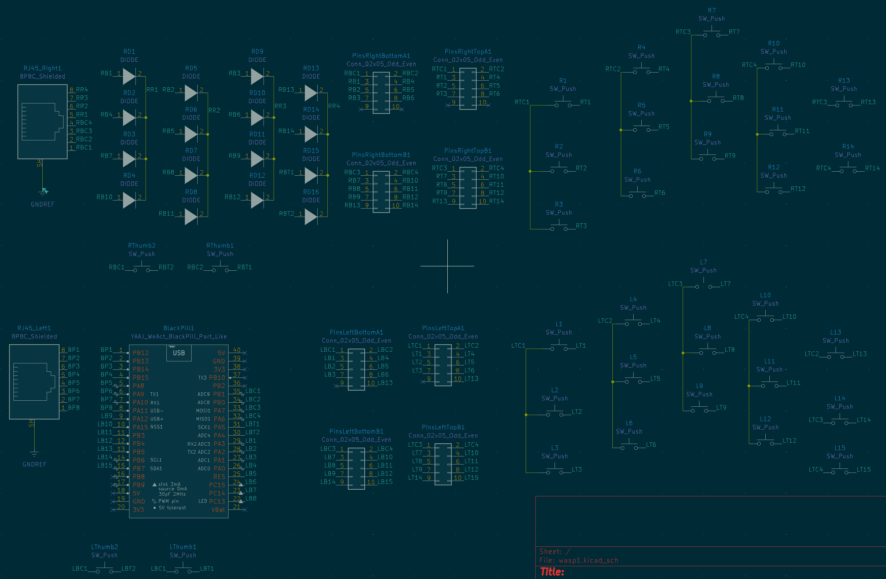
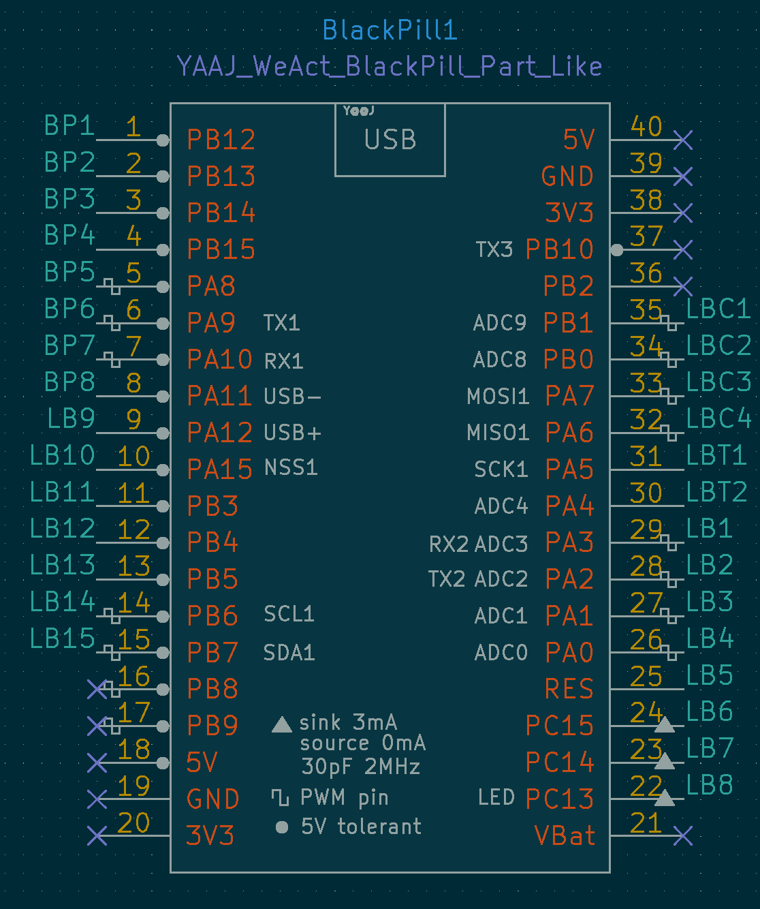

The Wasp
--------

It's small, black and yellow and it might sting you.

This is an attempt to make a dirt cheap split keyboard.
There is only one blackpill, keys on the other side are
wired via an RJ45 connector.

Builtin tenting and spikes using 2 pcbs per side, connected
in a 90 degree angle using double row pin header connectors.

